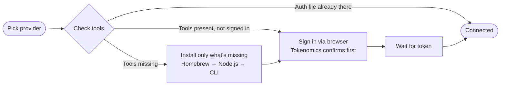
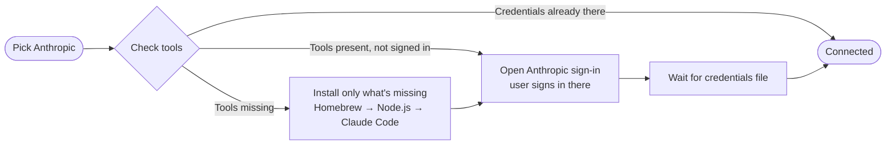
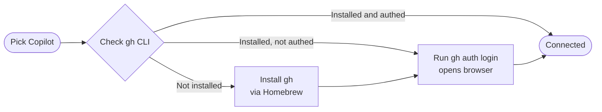
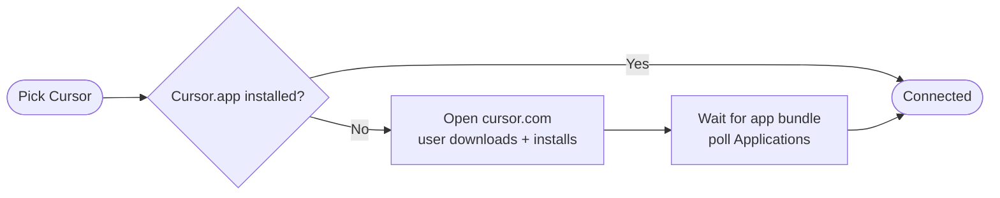
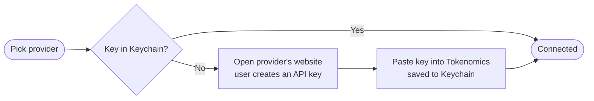

# Guided Onboarding — Plan

**Status:** Draft, pre-implementation
**Branch:** `feat/zero-terminal-onboarding` (this branch will pivot, not be replaced)
**Supersedes:** the embedded-Node + popover-driven approach from Phases 2–4
**Owner:** Rob

---

## North Star

**Walk the user through setup with simple, well-designed steps — not one opaque "magic" step.**

Three principles that fall out of that:

1. **Honesty over magic.** Tell users what's about to happen and let them watch it happen. A user who can name what was installed on their Mac trusts the app more than one who can't.
2. **Auto-detect ruthlessly.** Devs already have Node, Homebrew, and probably half the CLIs. Skip every step we can confirm is already done. Manual install is for users who actually need it.
3. **No Terminal typing.** The user never types or copy-pastes a command. Tokenomics runs commands as subprocesses, streams output to a polished UI, asks permission before each significant install. The user's job is to read, click Continue, and sign in via their browser.

This re-orients the original "zero-Terminal onboarding" framing. The goal isn't *fewer* steps — it's that **each step is so well-designed it doesn't feel like a step**.

---

## What changes vs current branch

| Concern | Current (Phase 4) | New (Phase 5) |
|---|---|---|
| Onboarding container | Menu-bar popover (dismisses on focus loss) | Real `Window` (persists across context switches) |
| Codex/Gemini install | Embedded Node (~40 MB), silent npm install | System Node via Homebrew, walked-through silent install with explicit user permission |
| Claude install | Manual via Terminal (public docs, hits EACCES) | Same walked-through model — Tokenomics runs `npm install -g @anthropic-ai/claude-code` for the user with a user-prefix |
| Per-provider shape | Asymmetric: magic for some, manual for others | Unified: every provider follows the same step-screen vocabulary |
| Bundle size | ~50 MB (with embedded Node) | ~10 MB (Node ripped) |
| Gemini ToS exposure | Yellow flag (CLI invoked invisibly) | Eliminated (user explicitly clicks through each install/sign-in step) |

---

## Architecture

### 1. Window-based onboarding

Use SwiftUI `WindowGroup` for the onboarding/setup experience. The menu-bar popover (`MenuBarExtra`) keeps doing what it's good at: showing live usage at a glance.

**Activation policy juggling.** Tokenomics is `LSUIElement: true` — no Dock icon by design. To show a real window without putting an icon in the Dock, switch `NSApplication.shared.setActivationPolicy()` to `.regular` when the onboarding window opens, back to `.accessory` when it closes. (Several reference apps do this — Bartender, Hand Mirror, etc.)

**Re-entry.** Add a "Setup providers" item to the popover's gear menu so users can return to the window any time.

### 2. Silent-with-permission install runner

A new service — `GuidedInstallRunner` — that:

- Spawns system shell commands as subprocesses (`brew install node`, `npm install -g @openai/codex`, etc.)
- Streams stdout/stderr line-by-line to a SwiftUI `@Observable` model the UI binds to
- Uses a per-user npm prefix (`~/.tokenomics-cli/` or similar) to avoid the `/opt/homebrew/lib/node_modules` EACCES wall
- Surfaces sudo prompts via AppleScript `do shell script with administrator privileges` when truly required (Homebrew install itself does NOT need sudo, so most flows won't hit this)
- Returns a typed result: `success | failed(reason) | userCancelled`

This is the same pattern as `EmbeddedCLIRunner` we're ripping out, just generalized to system commands rather than embedded-Node-only.

### 3. Detection layer

Before showing any step, run detection in parallel:

| Prerequisite | Detection |
|---|---|
| Homebrew | `/opt/homebrew/bin/brew` (Apple Silicon) or `/usr/local/bin/brew` (Intel) |
| Node | `node` resolvable in PATH; check `/opt/homebrew/bin/node`, `/usr/local/bin/node`, `~/.nvm/versions/node/*/bin/node`, `~/.fnm/aliases/default/bin/node`, `~/.volta/bin/node` |
| npm | comes with Node — same paths |
| Codex CLI | existing `CodexProvider` detection (system paths + user-prefix bin) |
| Gemini CLI | existing `GeminiProvider` detection (same shape) |
| Claude Code | existing `ClaudeProvider` detection |
| Cursor.app | existing `CursorProvider` detection (NSWorkspace bundle URL) |
| `gh` CLI (Copilot) | `/opt/homebrew/bin/gh`, `/usr/local/bin/gh` |

Each detected prerequisite removes its install step from the flow. A user with Homebrew, Node, and Codex CLI already installed sees "Sign in" as their only step. A fresh Mac sees the full chain.

### 4. Step-screen vocabulary

Every step is one of five screen types. Each provider's flow composes these:

- **Detect** — "Checking your Mac…" Quick scan, auto-advances.
- **Explain + Confirm** — "Tokenomics will install Node.js — needed to run the Codex and Gemini CLIs. About 30 seconds." Continue / Skip-I-already-have-this.
- **Progress** — Streams subprocess output, animated progress, "About 30 seconds" caption.
- **Auth handoff** — "Tokenomics will open Google's sign-in page in your browser." Continue button. (Already built for Gemini in this branch.)
- **Done** — "Connected ✓" with summary of what got installed/authorized.

Errors collapse the current step into an inline error block with a single recovery action ("Retry", "Open Homebrew docs", "Switch to manual install").

---

## Per-provider flows

### Codex (OpenAI)

```
Detect
  ├─ All present + auth → DONE (Connected ✓)
  ├─ codex CLI present + no auth → [Auth handoff] → DONE
  ├─ Node present, codex absent → [Explain+Confirm: install codex] → [Progress] → [Auth] → DONE
  ├─ Homebrew present, Node absent → [Explain+Confirm: install Node] → [Progress] → ...
  └─ Nothing present → [Explain+Confirm: install Homebrew] → [Progress] → ...
```

Same shape for Gemini, with a `gemini` package and the awaiting-user-confirm step we already built.

### Anthropic (Claude)

```
Detect
  ├─ Claude Code installed + signed in → DONE
  ├─ Claude Code installed, not signed in → [Auth: open browser to claude.com] → DONE
  └─ Not installed → [Explain+Confirm: install Claude Code] → [Progress] → [Auth] → DONE
```

Same install shape as Codex/Gemini. Anthropic's OAuth-policy restriction means we can't drive the auth ourselves — but we can still install the CLI for them and direct them through their own auth flow.

### Cursor

```
Detect
  ├─ Cursor.app installed → DONE (we read its local config)
  └─ Not installed → [Explain+Confirm: open cursor.com to download] → poll for bundle → DONE
```

No Tokenomics-driven install here (Cursor isn't an npm package). Same window though — link to download, poll for the bundle to appear, transition to Done.

### Copilot

```
Detect
  ├─ gh CLI authed → DONE
  ├─ gh CLI installed, not authed → [Auth: gh auth login] → DONE
  └─ gh CLI absent → [Explain+Confirm: install gh] → [Progress: brew install gh] → [Auth] → DONE
```

### API-key providers (Stability, Runway, ElevenLabs)

```
Detect
  ├─ Key in keychain → DONE
  └─ No key → [Explain+Confirm: open provider site to grab key] → [Paste key inline] → DONE
```

No install. Just keychain write.

---

## Visual flows (lightweight overview)

The 6 providers cluster into 4 distinct flow patterns. The chooser exists to
route the user to the right one — that's why it stays at the top of the funnel
even after all the other simplification.

### Pattern A — npm-CLI with automated OAuth (Codex, Gemini)



Most automated of all the flows. Tokenomics drives every step end-to-end. The
"Tokenomics confirms first" caveat is the explicit-user-click pattern we built
for Gemini — keeps the consent chain bulletproof.

### Pattern B — npm-CLI with user-driven auth (Claude)



Same install shape as Pattern A, but Anthropic's policy means **we can't drive
the OAuth ourselves** — we can only point the user at it. The install is still
silent; only the auth step puts them on Anthropic's own page.

### Pattern C — Homebrew-only CLI (Copilot)



No Node needed — `gh` is a Go binary distributed via Homebrew. Shorter
install chain than Pattern A or B.

### Pattern D — App bundle (Cursor)



Tokenomics doesn't manage Cursor — it just reads from the app's local config
once the bundle exists. Closest thing we have to a "no-op" flow.

### Pattern E — API key paste (Stability, Runway, ElevenLabs)



No install at all. The friction is on the provider's website (account setup,
billing, key generation) — Tokenomics' job is to make the paste step painless.

### Why this matters for the implementation

The 5 patterns map cleanly to **5 connector implementations** that already
exist (CodexConnector, GeminiConnector, ClaudeConnector, CopilotConnector,
CursorConnector, APIKeyConnector). Each connector knows its own dependency
tree and auth shape. The window UI is generic — it just renders whatever step
the active connector is currently in. That's why the migration plan above
focuses on the runner + window scaffold, not per-provider rewrites.

---

## State machine additions

Most of `ConnectorStep` is already correct. Two probable additions:

- `case installingDependency(name: String, progress: Double?)` — distinct from `installing(progress:)` so we can label "Installing Node.js…" vs "Installing Codex CLI…"
- `case waitingForExternalDownload(name: String)` — for Cursor.app polling

`ConnectorPipelineKind` (engineering-side) collapses to just `.multiStep` for everyone, since the new model walks every provider through steps. The single-shot/multi-step distinction stops being meaningful — we can probably drop the enum entirely after migration.

---

## Migration plan

**Order matters.** Each step should leave the app shippable.

### Step 1 — Window scaffold (1 session)
- Add `WindowGroup` + activation-policy switch
- Move existing `WelcomeView` + `ProviderChooserView` + `ConnectorView` into the window unchanged
- Popover loses its onboarding mode; gains a "Setup providers" entry-point
- Beta-shippable as-is — the existing connectors keep working

### Step 2 — `GuidedInstallRunner` + Homebrew/Node detection (1 session)
- New service for system-command subprocess streaming
- Detection layer for Homebrew/Node/npm
- Two new step screens: Detect, Explain+Confirm with the runner

### Step 3 — Migrate Codex + Gemini off embedded Node (1–2 sessions)
- Connectors switch from `EmbeddedCLIRunner` → `GuidedInstallRunner`
- New per-prerequisite step inserts (install Homebrew if missing, install Node if missing)
- Drop `Resources/embedded-node/` entirely from the bundle
- Drop the `EmbeddedNode` + `EmbeddedCLIRunner` services

### Step 4 — Add Claude install path (1 session)
- New `ClaudeConnector` install step that runs `npm install -g @anthropic-ai/claude-code` via the runner
- Auth step still hands off to user's own `claude` flow (per Anthropic policy)

### Step 5 — Polish + copy + error states (1 session)
- Each step screen visually consistent with the HTML mockup (TBD below)
- Real error copy for EACCES, network failure, partial install, etc.
- Re-entry path from popover

### Step 6 — Cut beta release
- Bundle drops from ~50 MB to ~10 MB
- Test matrix: fresh Mac, dev Mac with everything, dev Mac with partial setup, no internet

Reasonable estimate per CLAUDE.md benchmarks: **2–4 working days of Claude time + Rob's review**, plus design time on mockup and copy.

---

## Visual flow

[ TBD — Rob will add HTML mockup of the window and step-screens here. ]

The mockup should cover:

- **Window chrome** — title bar, close behavior, min size, what's in the toolbar
- **Provider chooser** layout (full-window version of current popover ProviderChooserView)
- **Step screens** — each of the 5 vocabulary types, populated and empty states
- **Progress streaming** — what subprocess output looks like in the polished UI
- **Error states** — what EACCES looks like, what offline looks like
- **Done state** — connected summary with the green checkmark

Ideally mockup is fidelity-aligned with current Tokenomics chrome (rounded corners, spacing, color tokens) so implementation is mostly translation work.

---

## Open questions

1. **Activation policy switching.** Smooth in practice or jumpy? Need to verify on real hardware that switching `.accessory ↔ .regular` doesn't flash a Dock icon for a frame.
2. **Admin prompts.** Homebrew install itself shouldn't need sudo (the script is designed to install to user-writable locations on Apple Silicon). But if we hit a case that needs it, the AppleScript-based admin prompt should match macOS's normal style. Verify.
3. **Power-user escape.** Should each Explain+Confirm screen have a "Run this in Terminal myself instead" link? Probably yes for transparency, even though the silent path is the default.
4. **Telemetry.** When an install fails, do we want anonymous error reporting? Out of scope for this plan but worth flagging for later.
5. **`ConnectorPipelineKind` cleanup.** If every connector becomes `.multiStep`, we can probably remove the enum entirely. Defer until migration is done.
6. **Re-entry from menu bar.** Existing users on the new build need a way to discover the setup window. Add it under the gear menu? A first-launch nudge?
7. **CLI updates.** What if `codex` or `gemini` releases a new version? Currently we rely on whatever's installed. Should the setup window offer "Update tools" as a separate path? Probably out-of-scope for v1.

---

## What this plan deliberately does NOT do

- No new providers added.
- No backend changes.
- No telemetry/analytics infrastructure.
- No multi-language localization beyond what's already in the app.
- No "import settings from old onboarding state" migration — the existing data model (provider connections, keychain entries) carries forward unchanged. The only thing being torn out is the embedded-Node infrastructure and the popover-as-onboarding constraint.
